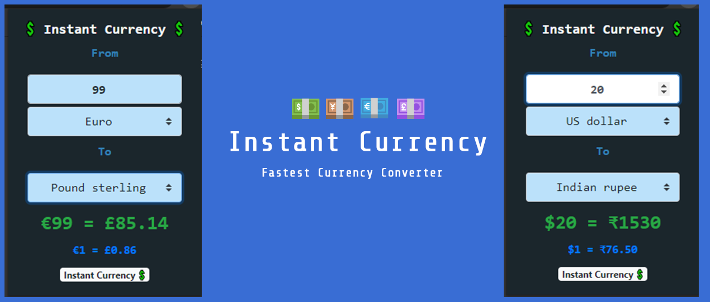

# Instant Currency
 A handy chrome extension to covert any currency to your local currency Instantly! 💲

### Add to your chrome [here]!
```
Do Rate ⭐ and send in Reviews 😄
```

## Overview 👀


- Instant Currency is a currency converter for chrome works as a extension 
- Choose from **173** different currency 💱
- Updates exchange rate every **60Mins** 💹
- **"Alt+C"** to convert any selected number in any web page to your desired currency 🌌
- Light weight **<20Kb** 📁
- Friendly UI and ⚡ fast response
- No strings attached 😄

## WIP 🛠
- Currently allows only **100 request/hr** (of course this extension uses api)😬
- with better userbase will shift api to premium service
- adding more info on rate falcuations
- support for cryptocurrency
## How To Contribute🤝
```
Entry point to code is popup.html
```
- Yes,it is open source you can clone and change code to your need.
- Most of the code is self explanatory, anyhow
- for any clarification on code or want to contribute contact 
- [Gmail] / [Twitter] /[LinkedIn]

## Sidenote 📄
- This whole project took around 8+hrs to make which include
```
- Learning to make chrome extension
- Searching for best api
- Designing UI and testing
- Coding the business logic 
```
- Publishing chrome extension to web store isnt free and fast 
- It costs $5 to make a developer account and almost 3-4 days of review time based on the type of extension you make
- Chrome Developer program follows a strict programming guidelines and a must for all extension to follow them, its likely to be **rejected** if not followed
- Your reviews and rating would definately help me to do more projects like this 😊 
- Drop your suggestion or any project idea you would like to share with me . **Thanks :)**

[Gmail]: <mailto:vashish888@gmail.com>
[LinkedIn]: <https://www.linkedin.com/in/asish-raju-7a0b90192>
[Twitter]: <https://twitter.com/vashish888>
[here]:<https://chrome.google.com/webstore/detail/instant-currency/lffbfebdjpoenhgcefjhmhjaidkkclno>